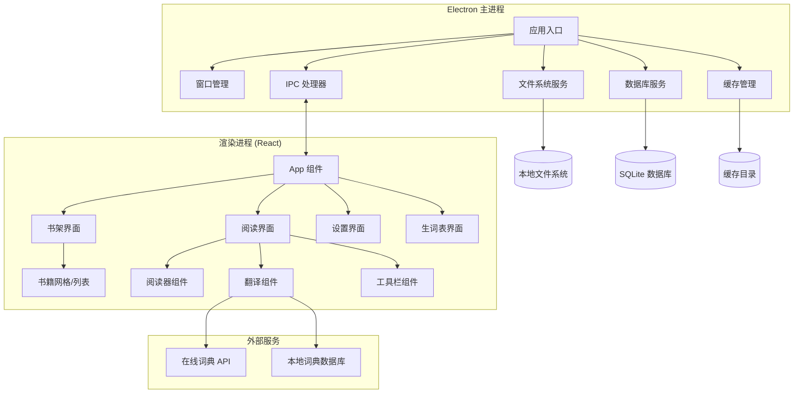

# 设计文档

## 概述

电子书阅读器采用 Electron + React 架构，实现跨平台桌面应用。应用分为主进程和渲染进程，主进程负责文件系统操作、数据库管理和系统级功能，渲染进程负责用户界面和交互逻辑。通过 IPC（进程间通信）实现两个进程之间的数据交换。

## 架构

### 整体架构图



### 技术栈

- **框架**: Electron 最新稳定版
- **前端**: React 18 + TypeScript
- **样式**: Tailwind CSS
- **状态管理**: React Context + useReducer
- **数据库**: SQLite (通过 better-sqlite3)
- **电子书解析**: 
  - EPUB: epub.js
  - PDF: pdf.js
  - MOBI: 自定义解析器
  - TXT: 内置文本处理
- **词典服务**: 有道词典 API + 本地词典备份

## 组件和接口

### 主进程服务

#### 文件系统服务 (FileSystemService)
```typescript
interface FileSystemService {
  importBook(filePath: string): Promise<BookMetadata>
  parseBookContent(bookId: string): Promise<BookContent>
  exportVocabulary(format: 'csv' | 'txt'): Promise<string>
  clearCache(bookId?: string): Promise<void>
}
```

#### 数据库服务 (DatabaseService)
```typescript
interface DatabaseService {
  // 书籍管理
  saveBook(book: BookMetadata): Promise<string>
  getBooks(): Promise<BookMetadata[]>
  deleteBook(bookId: string): Promise<void>
  
  // 阅读进度
  saveProgress(bookId: string, progress: ReadingProgress): Promise<void>
  getProgress(bookId: string): Promise<ReadingProgress>
  
  // 生词表
  addVocabulary(word: VocabularyItem): Promise<void>
  getVocabulary(): Promise<VocabularyItem[]>
  deleteVocabulary(wordId: string): Promise<void>
  
  // 设置
  saveSettings(bookId: string, settings: ReadingSettings): Promise<void>
  getSettings(bookId: string): Promise<ReadingSettings>
}
```

#### 缓存管理服务 (CacheService)
```typescript
interface CacheService {
  generateCache(bookId: string, content: BookContent): Promise<void>
  getCache(bookId: string): Promise<CachedBook>
  invalidateCache(bookId: string): Promise<void>
  getCacheSize(): Promise<number>
  cleanupCache(): Promise<void>
}
```

### 渲染进程组件

#### 应用状态管理
```typescript
interface AppState {
  currentView: 'bookshelf' | 'reader' | 'vocabulary' | 'settings'
  books: BookMetadata[]
  currentBook: BookMetadata | null
  readingProgress: ReadingProgress
  vocabulary: VocabularyItem[]
  settings: AppSettings
  theme: 'light' | 'dark'
}
```

#### 书架组件 (Bookshelf)
```typescript
interface BookshelfProps {
  books: BookMetadata[]
  viewMode: 'grid' | 'list'
  sortBy: 'title' | 'author' | 'date'
  searchQuery: string
  onBookSelect: (book: BookMetadata) => void
  onImportBook: () => void
}
```

#### 阅读器组件 (Reader)
```typescript
interface ReaderProps {
  book: BookMetadata
  content: BookContent
  progress: ReadingProgress
  settings: ReadingSettings
  onProgressChange: (progress: ReadingProgress) => void
  onSettingsChange: (settings: ReadingSettings) => void
}
```

#### 翻译组件 (Translation)
```typescript
interface TranslationProps {
  selectedText: string
  position: { x: number; y: number }
  onAddToVocabulary: (word: VocabularyItem) => void
  onClose: () => void
}
```

## 数据模型

### 书籍元数据 (BookMetadata)
```typescript
interface BookMetadata {
  id: string
  title: string
  author: string
  cover?: string
  format: 'epub' | 'pdf' | 'mobi' | 'txt'
  filePath: string
  fileSize: number
  importDate: Date
  lastReadDate?: Date
  totalPages: number
  language: string
}
```

### 阅读进度 (ReadingProgress)
```typescript
interface ReadingProgress {
  bookId: string
  currentPage: number
  currentChapter: number
  percentage: number
  position: string // 用于精确定位
  lastUpdateTime: Date
}
```

### 生词项 (VocabularyItem)
```typescript
interface VocabularyItem {
  id: string
  word: string
  translation: string
  pronunciation?: string
  example?: string
  bookId: string
  context: string
  addedDate: Date
  mastered: boolean
}
```

### 阅读设置 (ReadingSettings)
```typescript
interface ReadingSettings {
  bookId: string
  fontFamily: string
  fontSize: number
  lineHeight: number
  margin: number
  theme: 'light' | 'dark'
  pageMode: 'scroll' | 'pagination'
}
```

### 缓存书籍 (CachedBook)
```typescript
interface CachedBook {
  bookId: string
  chapters: Chapter[]
  toc: TableOfContent[]
  metadata: BookMetadata
  cacheVersion: string
  createdAt: Date
}

interface Chapter {
  id: string
  title: string
  content: string
  pageCount: number
  startPage: number
}
```

## 错误处理

### 错误类型定义
```typescript
enum ErrorType {
  FILE_NOT_FOUND = 'FILE_NOT_FOUND',
  UNSUPPORTED_FORMAT = 'UNSUPPORTED_FORMAT',
  PARSE_ERROR = 'PARSE_ERROR',
  CACHE_ERROR = 'CACHE_ERROR',
  DATABASE_ERROR = 'DATABASE_ERROR',
  NETWORK_ERROR = 'NETWORK_ERROR'
}

interface AppError {
  type: ErrorType
  message: string
  details?: any
  timestamp: Date
}
```

### 错误处理策略
1. **文件导入错误**: 显示用户友好的错误信息，提供重试选项
2. **缓存错误**: 自动重新生成缓存，失败时降级到直接解析
3. **数据库错误**: 提供数据恢复选项，必要时重建数据库
4. **网络错误**: 切换到离线模式，使用本地词典
5. **解析错误**: 尝试不同的解析策略，提供手动修复选项

## 测试策略

### 单元测试
- **服务层测试**: 测试所有主进程服务的核心功能
- **组件测试**: 使用 React Testing Library 测试 UI 组件
- **工具函数测试**: 测试解析器、格式化器等工具函数

### 集成测试
- **IPC 通信测试**: 测试主进程和渲染进程之间的数据交换
- **数据库集成测试**: 测试数据持久化和查询功能
- **文件系统集成测试**: 测试文件导入和缓存生成

### 端到端测试
- **用户流程测试**: 使用 Playwright 测试完整的用户操作流程
- **性能测试**: 测试书籍加载时间和内存使用
- **跨平台测试**: 在 Windows、macOS、Linux 上验证功能一致性

### 测试工具
- **单元测试**: Jest + React Testing Library
- **E2E 测试**: Playwright
- **性能测试**: 自定义性能监控工具
- **代码覆盖率**: Istanbul

## 性能优化

### 启动优化
1. **延迟加载**: 非核心模块按需加载
2. **缓存预热**: 启动时预加载最近阅读的书籍缓存
3. **资源压缩**: 压缩静态资源和依赖包

### 内存管理
1. **分页加载**: 大文件内容分页加载，避免一次性加载整本书
2. **虚拟滚动**: 长列表使用虚拟滚动减少 DOM 节点
3. **内存监控**: 实时监控内存使用，超限时自动清理

### 渲染优化
1. **React 优化**: 使用 React.memo、useMemo、useCallback 避免不必要的重渲染
2. **CSS 优化**: 使用 CSS-in-JS 或 CSS Modules 避免样式冲突
3. **图片优化**: 封面图片懒加载和尺寸优化

### 缓存策略
1. **多级缓存**: 内存缓存 + 磁盘缓存 + 数据库缓存
2. **增量更新**: 只缓存变更的内容部分
3. **LRU 淘汰**: 使用 LRU 算法管理缓存空间

## 安全考虑

### 文件安全
1. **文件类型验证**: 严格验证导入文件的格式和内容
2. **路径遍历防护**: 防止恶意文件路径访问系统文件
3. **文件大小限制**: 限制单个文件的最大大小

### 数据安全
1. **本地加密**: 敏感数据（生词表、阅读记录）加密存储
2. **SQL 注入防护**: 使用参数化查询防止 SQL 注入
3. **XSS 防护**: 对用户输入和书籍内容进行适当的转义

### 网络安全
1. **HTTPS 通信**: 所有外部 API 调用使用 HTTPS
2. **API 密钥管理**: 安全存储和管理第三方 API 密钥
3. **请求限制**: 实现请求频率限制防止滥用